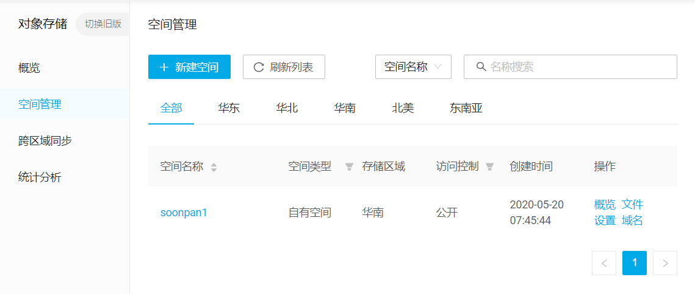
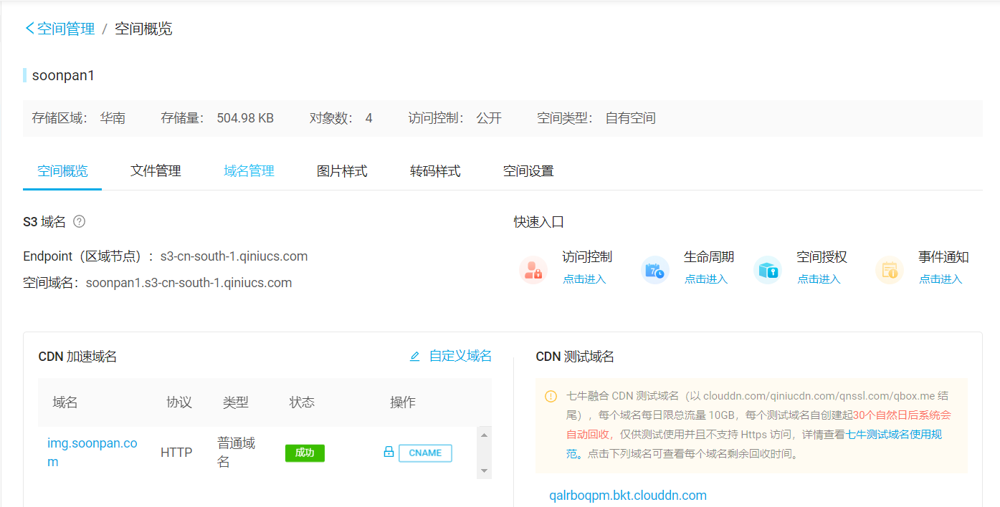
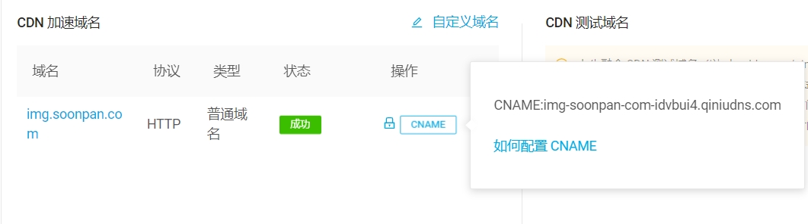
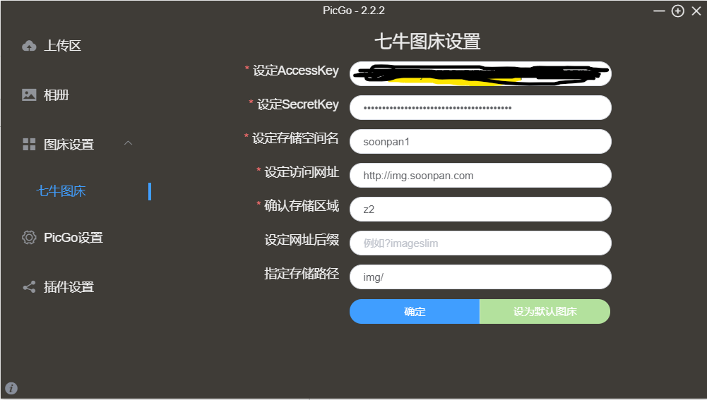
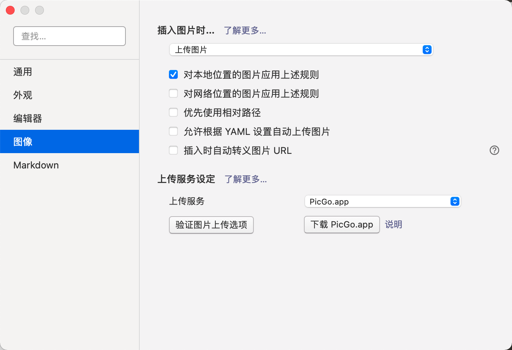
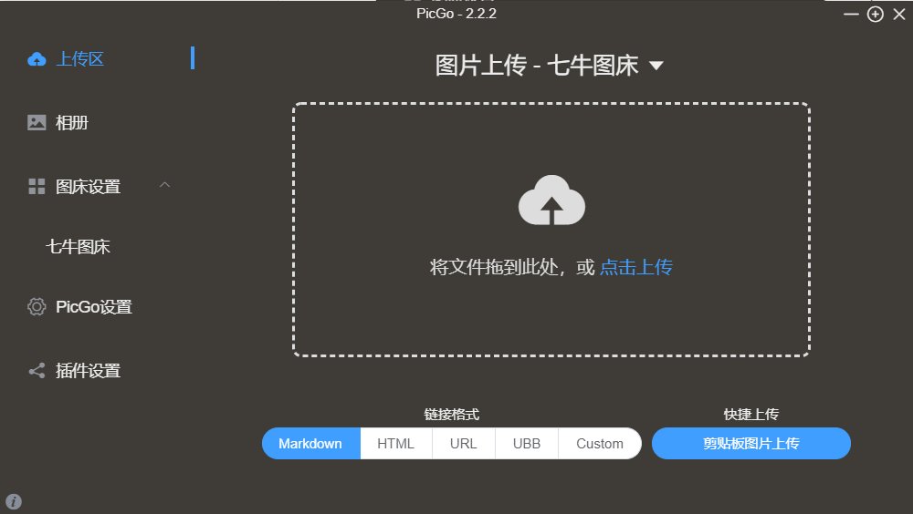

+++
title="七牛云.PicGO.Markdown"
tags=["golang"]
categories=["Golang"]
date="2021-03-10T23:49:56+08:00"
toc=true
+++

# 七牛云

注册七牛云并实名认证，即可免费使用对象存储

首先新建空间

打开概览

# PicGo的配置

[PicGo](https://github.com/Molunerfinn/PicGo/releases)是一款开源的图床上传工具，支持七牛云、阿里COS、腾讯COS等。

- Accesskey和SecretKey在七牛云的个人中心秘钥管理中。

- 储存空间名，同上你创建的名字

- 存储区域，七牛云代码，对应华东（z0）、华北（z1）、华南（z2）、北美（z3）、东南亚（z4）

- 设定访问网址，自用的没有网站的话，直接填写空间概览中的域名，空间域名加上前缀如`http://`soonpan1.s3-cn-south-1.qiniucs.com, 这里我设定了CNAME，所以填写的是我网站的解析域名。如果你有自己的网站，可以设定CNAME，将链接映射到七牛云。点击如何设置CNAME即可按照教程设定。

- 网址后缀没必要设定

- 指定存储路径后面记得加反斜杠img`/`

在Typora里设置PicGo自动上传图片

或者手动上传图片，PicGo上传文件后会自动将图片的链接复制到剪贴板，使用时直接粘贴就行。

一般返回样式是`![]http://soonpan1.s3-cn-south-1.qiniucs.com/img/XXXXX.png`

这里我设置了CNAME，所以我返回的链接样式是``

接下来就可以愉快的写markdown了，再也不用担心图片的存储问题啦。

